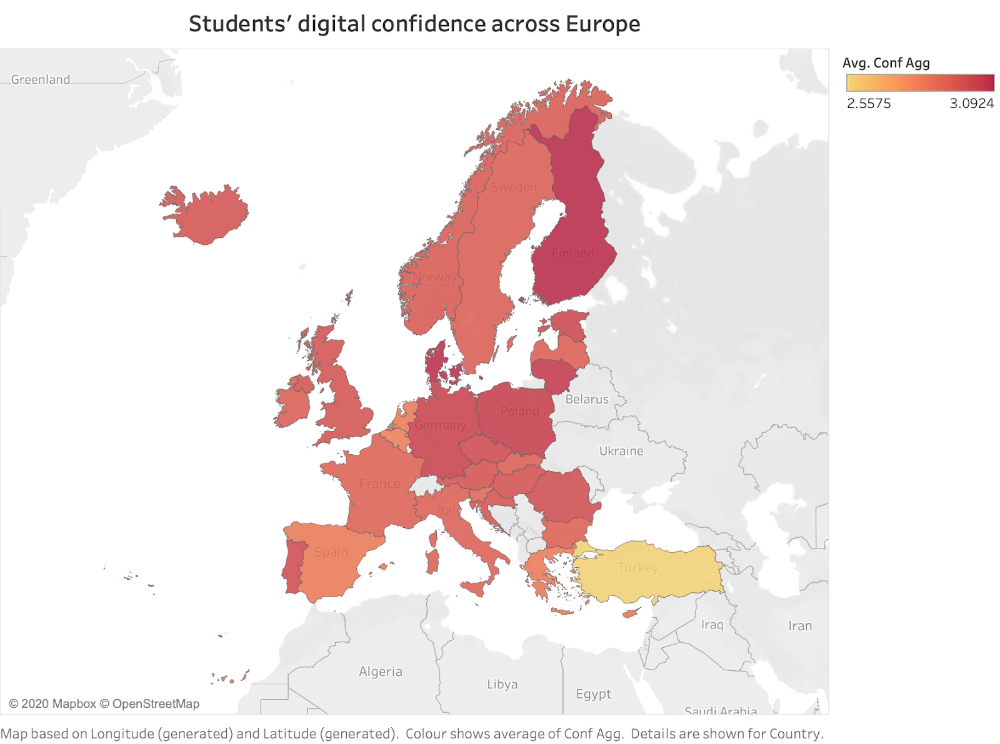
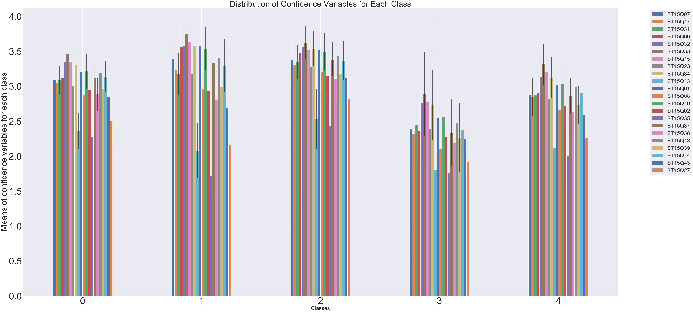

# Data Science Capstone: Predicting Students’ Digital Confidence in Schools Across Europe Based on the European Commission’s 2nd Survey of Schools

<b>Introduction and Aims</b>

Technological skills and competence are essential to entering the 21st century workforce, especially as technologies evolve quickly and become an increasingly integral part of the economy. However, technology provision, access and connectivity do not, in themselves, lead to ICT competence in learning and teaching (international comparative study of pedagogy and ICT use in schools, SITES 2006).  For this reason, the topic of students’ digital self-efficacy and confidence has gained considerable attention in research about students’ learning and outcomes.

The European Commission’s 2nd Survey of Schools: ICT in Education was conducted in 2018, following the first survey conducted in 2011-2012. It was a survey of head teachers, teachers, students and parents from the EU28, Norway, Iceland and Turkey, and it provided detailed information related to access to, use of, and attitudes towards use of digital technologies in schools.  It also collected information about the digital home environment of students and schools’ digital policies, strategies and opinions. Finally, it surveyed teachers and students about their digital activities inside and outside the classroom and their confidence in using various digital technologies, including their perceived ability to perform 20 ICT‐related tasks using a Likert scale ranging from ‘none’ to ‘a lot’.

<b>Goals of this project</b>

- Use student survey questions to predict student confidence in an exploratory way

- Add in teacher student survey questions to see if the model scores improve

- Perform a cluster analysis to better understand students’ digital confidence (with more fine-grained detail than just low/high confidence)

- Prioritise parsimonious models to examine the most important features

<b>Describing the data</b>

The student survey data consisted of:

- 11.3 % missing values, imputed with mean
- 48835 rows, 181 columns

The variables were all scales (except country code), with some skew on the variables with higher ranges but very few outliers due to small scale ranges. There was high multicollinearity among many of the variables.

The teacher survey data consisted of:
- 6.6% missing data, imputed with mean
- 9927 rows, 151 columns

The variables were  all scales (except the country code), with some skew in the variables with higher ranges but very few outliers due to small scale ranges. I decided to treat variables as continuous, except for the country. There was also high multicollinearity among many of the variables.

The target variable was student confidence, which comprised of 23 questions asking how confident students were at the following tasks:
- File electronic documents in computer folders and sub-folders
- Identify online sources of reliable information 
- Check if the information that I find online is true 
- Find websites advertising jobs on offer 
- Email a file to someone/another student or teacher
- Use other online tools on a computer (e.g. Viber, Google Hangouts, Facebook, Skype, etc.) to contact someone 
- Use mobile applications on a smartphone or a tablet (WhatsApp, Viber, Telegram, Google Hangouts, Facebook messenger, etc.) to contact someone
- Participate in social networks and use most of their features (e.g. Facebook, Instagram, Twitter, Snapchat, Ask.fm, etc.)
- Use information found on the internet without plagiarising (e.g. copy/paste in homework)
- Interacting with other people online in a respectful and polite manner
- Create blogs or websites and maintain them
- Produce text using a word processing programme (e.g. Word)
- Use spreadsheet programmes (e.g. Excel)
- Create a presentation (e.g. PowerPoint)
- Edit digital photographs or other graphic images, or videos
- Code/programme apps, programmes and/or robots
- Change your privacy settings (e.g. on a social networking site)
- Run a virus scan on your computer to detect malware
- Use the Internet safely to protect yourself against bullying
- Use ICT safely to protect your health against the risks of technologies overuse (e.g. insomnia, back pain, computer addiction)
- Update the operating system and applications of your computer, tablet or smartphone
- Learning with educational software, games, apps and quizzes
- Participate in online training programmes

The survey asked to select one answer for each item.

  <b>I mapped aggregate confidence across all of the EU countries surveyed:</b>

  

I iniitally divided the target variable, confidence, into two (relatively) equal groups of ‘low’ and ‘high’ confidence around the median. That is, 54% of participants were in in the low confidence group and 45% of participants were in the high confidence group. These were uneven groups due to the the high proportion of data points that were positioned exactly at the median.

<b> Modelling </b>

I separated train and test sets and used  cross-validation scores to check for robustness. I applied several machine learning classification models with many different parameters and identified the accuracy as well as precision and recall scores to determine success of the models. I also conducted a Hierarchical Cluster Analysis to determine whether it would be useful to utilise different target classes (i.e. besides just 'low' and 'high' confidence) based on the 
confidence variables. That is, I wanted to know if the 23 confidence questions varied systematically in more nuanced ways across participants. I examined groups at n = 5, 3, and 2 clusters. I utilised both z linkage and kmeans clustering. 

After qualitatively studying the differences between the three different cluster analyses, it seemed that using five clusters helped to shed some granular insights into the data (i.e. that there might be more nuanced distinctions between classrooms' digital confidence besides just low/(medium)/high). 

For example: Group 2 had higher variability between lows and highs, with very low confidence with coding & creating websites, and high confidence on using mobile applications/social media. Group 3 was consistently high among variables, with very high scores on coding and creating websites. Group 4 was consistently low overall - low on both coding/programming/creating websites and social media/communication. Therefore, I decided to use these five clusters as my target variable to see if using these clusters as classes helped the predictive model to improve in accuracy and could help shed insights about what factors might predict these distinct classes (especially groups 2, 3, and 4). 

  <b>I visualized the distribution of the 23 confidence questions across the 5 distinct clusters:</b>

  

<a href="https://github.com/courtfroehlig/Data-Science-Capstone-Project/blob/main/ConfidenceVariableCodes">
  
 
See confidence variable codes
</a>

<b>Findings</b>

Accuracy scores were much better than baseline in this phase of modelling utilising five different clusters as the target classes. Utilising the Support Vector Machine had the best accuracy score (.55, compared to .3799 baseline). 

<u>Utilising these five groups as target classes provided some interesting insights with predictive modelling:</u>

Firstly, students were most likely to be a part of the varied confidence group when they often spent time chatting online in their free time and they were least likely to be part of this group when they reported engaging in coding and programming, both in the classroom and in freetime. Students from Finland were most likely to be a part of this group. 

Secondly, students were most likely to be a part of the high confidence group when they had positive attitudes about ICT's power to support collaboration and they engaged in coding and programming apps during lessons, and they were least likely to be part of the high confidence group when they often engaged in social networks. Students from Norway were least likely to be a part of this group.

Finally, students were most likely to be a part of the low confidence group when they reported that their schools encouraged ICT to learn by doing in the classroom and double-checked with another source to determine if an online source was reliable and they were least likely to be a part of this group when they reported that they felt ICT supported independence in learning and engaged in using multimedia production tools in lessons. <b>While this last finding seems counterintuitive, it is possible that students who reported critical digital literacy skills (i.e. they reported being actively engaged in critical thinking and learning by doing within digital environments) were more likely to rate their own digital confidence as lower.</b>

I then decided to more systematically determine the optimal number of clusters, utilising heuristics such as the elbow plots and sillhouette scores. The 'elbow' (i.e. the point after which the SSE drops rapidly, afterwhich decreases in inertia are considerably more marginal than for previous increases in number of clusters) looks to be between 1 and 2 clusters. However, the point at which this elbow actually lied on the plot was somewhat ambiguous. Further, two clusters provided the best silhouette coefficient (.207), compared to .111 for five groups. Based on these evaluation methods, I decided to try modelling (i.e. predicting confidence)  using two clusters (from the hierarchical clustering method), to compare these clusters to the initial modelling using the low/high confidence groups. However, utilising two clusters as the target classes provided similar accuracy scores to the first phase of modelling with low/high confidence groups.

Interestingly, adding in teacher survey data into the predictive model (i.e. using the two clusters from the most recent clustering analysis) improved the model accuracy score, albeit not by a large margin. Teachers' involvement in advanced courses on internet use, their attitudes about ICT use as positively impacting on student motivation, and their practices around presenting to the entire class were important positive predictors of their students being in the higher confidence class, and their lack of experience negatively predicted being in the high confidence class. 

<b>Reflections and next steps</b>

It is important to think about different types of digital competence, e.g. operational use and social media use, as well as descriminating social media use for communication with other students about school work vs. use for recreational/leisure purposes). Further, here may be certain students who feel confident in their digital social media skills but not as confident in more technical applications (e.g. coding/programming), and it would interesting to know whether and how frequency of social media use might be related to students' safe and responsible use of the internet and/or critical digital literacy. In general, the variability in confidence across dimensions of ICT use is an important finding which could have implications for how we characterise and measure digital confidence in future surveys and studies. Further, students reported overall lower confidence on programming/creating websites across all groups, but they reported higher confidence when they participated in online training programmes and used ICT to collaborate with other students; therefore, it may be important for schools to invest in online training programmes, especially those that promote collaborative learning. Finally, it may be important for schools to focus on investing in teachers' professional development in ICT, with a particular focus on supporting them to understand how to teach ICT in a way that can cater to an entire class of diverse learners and in ways that help them understand how their teaching around ICT might support student motivation.

Moving forward, it would be valuable to:
1. Look at differences between age groups/school levels
2. Measure actual digital competence/skills in order develop a better understanding of how outcomes relate to confidence
3. Examine students’ experiences with ICT in schools and at home as predictors of digital skills and competence

Navigating this repository:

<a href="https://github.com/courtfroehlig/DSICapstone/blob/main/CF_Capstone_Data%20cleaning%20and%20exploration.ipynb">Data Cleaning and Exploration</a>

<a href="https://github.com/courtfroehlig/DSICapstone/blob/main/CF_Capstone_Modelling%20and%20Findings.ipynb">Data Modelling and Findings</a>

NB: For full functionality of html links within each notebook, please view them by pasting the notebook link into https://nbviewer.jupyter.org/

